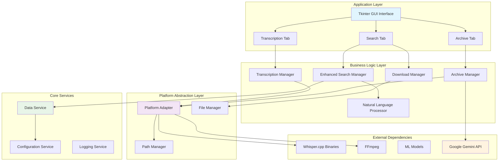

# Design Document

## Overview

本設計文件描述如何將現有的 AI 智慧工作站擴展為跨平台應用程式，支援 Windows 和 macOS，並增強媒體搜尋功能，實現自然語言搜尋和檔案下載功能。

現有系統已包含三大核心功能：
1. **語音轉錄** - 基於 Whisper.cpp 的音頻轉文字功能
2. **AI 媒體庫歸檔** - 使用 Google Gemini AI 自動分析和歸檔媒體檔案
3. **媒體搜尋** - 基於 CSV 資料的媒體內容搜尋

基於現有的 Tkinter GUI 應用程式架構，我們將採用模組化設計，確保核心功能在不同作業系統上的一致性，同時針對平台特定需求進行適配，並大幅增強搜尋和下載功能。

## Architecture

### 系統架構圖



### 核心模組設計

1. **跨平台抽象層 (Platform Abstraction Layer)**
   - 處理作業系統差異
   - 統一檔案路徑格式
   - 管理平台特定的執行檔

2. **轉錄管理器 (Transcription Manager)**
   - Whisper.cpp 整合和調用
   - 音頻格式轉換 (FFmpeg)
   - AI 校正和分析功能
   - 多種輸出格式支援

3. **歸檔管理器 (Archive Manager)**
   - Google Gemini AI 整合
   - 媒體檔案自動分析
   - 智能分類和標籤生成
   - 批次處理和進度追蹤

4. **增強搜尋管理器 (Enhanced Search Manager)**
   - 自然語言查詢解析
   - 多欄位模糊搜尋
   - 結果排序和過濾

5. **下載管理器 (Download Manager)**
   - 單檔案和批次下載
   - 進度追蹤
   - 錯誤處理和重試

## Components and Interfaces

### 1. Platform Adapter (平台適配器)

```python
class PlatformAdapter:
    """處理跨平台相容性的核心類別"""
    
    @staticmethod
    def get_platform() -> str:
        """取得當前平台類型"""
        
    @staticmethod
    def get_executable_path(base_name: str) -> str:
        """根據平台取得正確的執行檔路徑"""
        
    @staticmethod
    def normalize_path(path: str) -> str:
        """標準化檔案路徑格式"""
        
    @staticmethod
    def get_resource_path(resource_name: str) -> str:
        """取得資源檔案的正確路徑"""
```

### 2. Natural Language Search Engine (自然語言搜尋引擎)

```python
class NaturalLanguageSearchEngine:
    """處理自然語言搜尋查詢的類別"""
    
    def __init__(self):
        self.emotion_keywords = {...}  # 情緒關鍵字映射
        self.technical_keywords = {...}  # 技術關鍵字映射
        
    def parse_query(self, query: str) -> SearchCriteria:
        """解析自然語言查詢為搜尋條件"""
        
    def extract_keywords(self, query: str) -> List[str]:
        """從查詢中提取關鍵字"""
        
    def match_emotions(self, query: str) -> List[str]:
        """匹配情緒相關的查詢"""
        
    def build_search_filter(self, criteria: SearchCriteria) -> callable:
        """建立搜尋過濾器函數"""
```

### 3. Enhanced Search Manager (增強搜尋管理器)

```python
class EnhancedSearchManager:
    """增強的媒體搜尋管理器"""
    
    def __init__(self, data_service: DataService):
        self.data_service = data_service
        self.nl_engine = NaturalLanguageSearchEngine()
        self.search_history = []
        
    def search(self, query: str, filters: Dict = None) -> SearchResults:
        """執行搜尋並返回結果"""
        
    def get_suggestions(self, partial_query: str) -> List[str]:
        """提供搜尋建議"""
        
    def rank_results(self, results: List[Dict], query: str) -> List[Dict]:
        """根據相關性排序搜尋結果"""
```

### 4. Transcription Manager (轉錄管理器)

```python
class TranscriptionManager:
    """處理語音轉錄的管理器"""
    
    def __init__(self, platform_adapter: PlatformAdapter):
        self.platform_adapter = platform_adapter
        self.whisper_path = None
        self.ffmpeg_path = None
        
    def initialize_whisper(self) -> bool:
        """初始化 Whisper.cpp 環境"""
        
    def transcribe_audio(self, audio_path: str, model: str, 
                        options: TranscriptionOptions) -> TranscriptionResult:
        """執行音頻轉錄"""
        
    def convert_audio_format(self, input_path: str, output_path: str) -> bool:
        """使用 FFmpeg 轉換音頻格式"""
        
    def apply_ai_correction(self, srt_content: str, api_key: str) -> str:
        """使用 AI 校正轉錄結果"""
        
    def generate_multiple_formats(self, transcription: str, 
                                 output_dir: str) -> List[str]:
        """生成多種輸出格式"""
```

### 5. Archive Manager (歸檔管理器)

```python
class ArchiveManager:
    """處理媒體歸檔的管理器"""
    
    def __init__(self, config: Dict):
        self.config = config
        self.gemini_client = None
        self.processing_queue = Queue()
        
    def initialize_ai_service(self, api_key: str) -> bool:
        """初始化 Google Gemini AI 服務"""
        
    def analyze_media_file(self, file_path: str, file_type: str) -> Dict:
        """分析單個媒體檔案"""
        
    def batch_process_files(self, source_folder: str, 
                           target_folder: str, 
                           progress_callback: callable) -> None:
        """批次處理媒體檔案"""
        
    def generate_metadata(self, analysis_result: Dict) -> Dict:
        """生成標準化的元數據"""
        
    def organize_file(self, file_path: str, metadata: Dict, 
                     target_folder: str) -> str:
        """根據元數據組織檔案"""
```

### 6. Download Manager (下載管理器)

```python
class DownloadManager:
    """處理檔案下載的管理器"""
    
    def __init__(self, platform_adapter: PlatformAdapter):
        self.platform_adapter = platform_adapter
        self.active_downloads = {}
        
    def download_file(self, source_path: str, destination_path: str, 
                     progress_callback: callable = None) -> DownloadTask:
        """下載單個檔案"""
        
    def batch_download(self, file_list: List[Tuple[str, str]], 
                      progress_callback: callable = None) -> BatchDownloadTask:
        """批次下載多個檔案"""
        
    def cancel_download(self, task_id: str) -> bool:
        """取消下載任務"""
```

### 5. Enhanced UI Components (增強的 UI 元件)

```python
class EnhancedSearchTab:
    """增強的搜尋頁籤"""
    
    def __init__(self, parent, search_manager: EnhancedSearchManager, 
                 download_manager: DownloadManager):
        self.search_manager = search_manager
        self.download_manager = download_manager
        self.create_widgets()
        
    def create_search_interface(self):
        """建立搜尋介面"""
        
    def create_results_display(self):
        """建立結果顯示區域"""
        
    def create_preview_panel(self):
        """建立預覽面板"""
        
    def handle_download_request(self, selected_items: List):
        """處理下載請求"""
```

## Data Models

### 1. Search Criteria (搜尋條件)

```python
@dataclass
class SearchCriteria:
    """搜尋條件資料模型"""
    keywords: List[str]
    emotions: List[str]
    file_types: List[str]
    categories: List[str]
    date_range: Optional[Tuple[datetime, datetime]]
    technical_filters: Dict[str, Any]
    sort_by: str = "relevance"
    sort_order: str = "desc"
```

### 2. Search Results (搜尋結果)

```python
@dataclass
class SearchResult:
    """單個搜尋結果"""
    file_id: str
    title: str
    file_type: str
    file_path: str
    thumbnail_path: Optional[str]
    relevance_score: float
    metadata: Dict[str, Any]
    
@dataclass
class SearchResults:
    """搜尋結果集合"""
    results: List[SearchResult]
    total_count: int
    query: str
    execution_time: float
    suggestions: List[str]
```

### 3. Download Task (下載任務)

```python
@dataclass
class DownloadTask:
    """下載任務資料模型"""
    task_id: str
    source_path: str
    destination_path: str
    file_size: int
    downloaded_size: int
    status: DownloadStatus
    start_time: datetime
    estimated_completion: Optional[datetime]
    error_message: Optional[str]
```

## Error Handling

### 錯誤處理策略

1. **平台相容性錯誤**
   - 自動偵測並適配不同作業系統
   - 提供清楚的錯誤訊息和解決建議
   - 優雅降級處理

2. **搜尋錯誤**
   - 查詢解析失敗時提供建議
   - 資料載入錯誤的恢復機制
   - 搜尋超時處理

3. **下載錯誤**
   - 網路中斷重試機制
   - 磁碟空間不足警告
   - 檔案權限問題處理

### 錯誤類別定義

```python
class CrossPlatformError(Exception):
    """跨平台相關錯誤"""
    pass

class SearchError(Exception):
    """搜尋相關錯誤"""
    pass

class DownloadError(Exception):
    """下載相關錯誤"""
    pass

class PlatformNotSupportedError(CrossPlatformError):
    """不支援的平台錯誤"""
    pass
```

## Testing Strategy

### 測試架構

1. **單元測試**
   - 平台適配器功能測試
   - 自然語言搜尋引擎測試
   - 下載管理器功能測試

2. **整合測試**
   - 跨平台相容性測試
   - 搜尋功能端到端測試
   - 下載流程完整性測試

3. **平台特定測試**
   - Windows 環境測試
   - macOS 環境測試
   - 檔案系統相容性測試

### 測試工具和框架

```python
# 測試配置範例
class TestConfig:
    """測試配置"""
    PLATFORMS = ["windows", "macos"]
    TEST_DATA_PATH = "test_data"
    MOCK_MEDIA_DB = "test_media.csv"
    
    @staticmethod
    def get_platform_specific_paths():
        """取得平台特定的測試路徑"""
        pass
```

## Performance Considerations

### 效能最佳化策略

1. **搜尋效能**
   - 建立搜尋索引以加速查詢
   - 實施查詢結果快取機制
   - 分頁載入大量結果

2. **UI 響應性**
   - 非同步搜尋執行
   - 漸進式結果載入
   - 背景縮圖生成

3. **記憶體管理**
   - 圖片縮圖快取策略
   - 大型資料集的分批處理
   - 及時釋放不需要的資源

### 效能監控

```python
class PerformanceMonitor:
    """效能監控器"""
    
    def __init__(self):
        self.metrics = {}
        
    def track_search_time(self, query: str, execution_time: float):
        """追蹤搜尋執行時間"""
        
    def track_download_speed(self, file_size: int, duration: float):
        """追蹤下載速度"""
        
    def get_performance_report(self) -> Dict:
        """取得效能報告"""
```

## Security Considerations

### 安全性設計

1. **檔案存取安全**
   - 驗證檔案路徑的合法性
   - 防止路徑遍歷攻擊
   - 檔案權限檢查

2. **資料保護**
   - 敏感資訊加密存儲
   - API 金鑰安全管理
   - 使用者資料隱私保護

3. **輸入驗證**
   - 搜尋查詢輸入清理
   - 檔案名稱驗證
   - 路徑注入防護

## Deployment Strategy

### 部署架構

1. **打包策略**
   - 使用 PyInstaller 建立獨立執行檔
   - 平台特定的資源檔案打包
   - 相依性自動檢測和包含

2. **安裝程式**
   - Windows: 使用 NSIS 或 Inno Setup
   - macOS: 建立 .app 套件和 .dmg 映像檔
   - 自動相依性安裝

3. **更新機制**
   - 版本檢查和自動更新
   - 增量更新支援
   - 回滾機制

### 部署配置範例

```python
# PyInstaller 配置
PYINSTALLER_CONFIG = {
    "windows": {
        "icon": "resources/icon.ico",
        "additional_files": [
            ("whisper_resources_coreml", "whisper_resources_coreml"),
            ("models", "models")
        ]
    },
    "macos": {
        "icon": "resources/icon.icns",
        "bundle_identifier": "com.example.whisper-gui",
        "additional_files": [
            ("whisper_resources_coreml", "whisper_resources_coreml"),
            ("models", "models")
        ]
    }
}
```