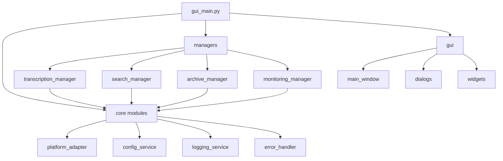

# 開發者指南

## 目錄

1. [開發環境設定](#開發環境設定)
2. [專案結構](#專案結構)
3. [程式碼規範](#程式碼規範)
4. [測試指南](#測試指南)
5. [建置和部署](#建置和部署)
6. [貢獻指南](#貢獻指南)
7. [擴展開發](#擴展開發)
8. [除錯技巧](#除錯技巧)

## 開發環境設定

### 系統需求

- **Python**: 3.8 或更高版本
- **作業系統**: Windows 10+, macOS 10.14+, Ubuntu 18.04+
- **記憶體**: 至少 8GB RAM（建議 16GB）
- **磁碟空間**: 至少 5GB 可用空間

### 環境準備

#### 1. 克隆專案

```bash
git clone https://github.com/kiro-ai/workstation.git
cd workstation
```

#### 2. 建立虛擬環境

```bash
# 使用 venv
python -m venv venv

# 啟動虛擬環境
# Windows
venv\Scripts\activate
# macOS/Linux
source venv/bin/activate
```

#### 3. 安裝依賴

```bash
# 安裝基本依賴
pip install -r requirements.txt

# 安裝開發依賴
pip install -r requirements-dev.txt
```

#### 4. 設定開發配置

```bash
# 複製配置範本
cp config/config.example.json config/config.json

# 編輯配置檔案
# 設定 API 金鑰和其他開發參數
```

#### 5. 執行測試

```bash
# 執行完整測試套件
python run_all_tests.py

# 執行特定測試
python -m pytest tests/test_transcription.py -v
```

### 開發工具推薦

#### IDE 和編輯器
- **PyCharm**: 功能完整的 Python IDE
- **VS Code**: 輕量級編輯器，配合 Python 擴展
- **Sublime Text**: 快速的文字編輯器

#### 必要擴展（VS Code）
```json
{
    "recommendations": [
        "ms-python.python",
        "ms-python.pylint",
        "ms-python.black-formatter",
        "ms-python.isort",
        "ms-toolsai.jupyter",
        "ms-vscode.test-adapter-converter"
    ]
}
```

#### 程式碼品質工具

```bash
# 安裝程式碼品質工具
pip install black isort flake8 mypy pre-commit

# 設定 pre-commit hooks
pre-commit install
```

## 專案結構

### 目錄結構

```
workstation/
├── gui_main.py                 # 主程式入口
├── requirements.txt            # 依賴清單
├── requirements-dev.txt        # 開發依賴
├── setup.py                   # 安裝腳本
├── version.json               # 版本資訊
├── CHANGELOG.md               # 更新日誌
├── README.md                  # 專案說明
├── LICENSE                    # 授權條款
│
├── core/                      # 核心模組
│   ├── __init__.py
│   ├── platform_adapter.py    # 跨平台適配
│   ├── config_service.py      # 配置管理
│   ├── logging_service.py     # 日誌服務
│   └── error_handler.py       # 錯誤處理
│
├── managers/                  # 功能管理器
│   ├── __init__.py
│   ├── transcription_manager.py    # 轉錄管理
│   ├── enhanced_search_manager.py  # 搜尋管理
│   ├── archive_manager.py          # 歸檔管理
│   ├── monitoring_manager.py       # 監控管理
│   ├── diagnostics_manager.py      # 診斷管理
│   ├── update_manager.py           # 更新管理
│   ├── download_manager.py         # 下載管理
│   └── performance_monitor.py      # 效能監控
│
├── utils/                     # 工具模組
│   ├── __init__.py
│   ├── query_parser.py        # 查詢解析
│   ├── natural_language_search.py  # 自然語言搜尋
│   └── file_utils.py          # 檔案工具
│
├── gui/                       # 圖形介面
│   ├── __init__.py
│   ├── main_window.py         # 主視窗
│   ├── dialogs/               # 對話框
│   ├── widgets/               # 自訂元件
│   └── themes/                # 主題檔案
│
├── tests/                     # 測試檔案
│   ├── __init__.py
│   ├── conftest.py            # pytest 配置
│   ├── test_transcription.py  # 轉錄測試
│   ├── test_search.py         # 搜尋測試
│   ├── test_archive.py        # 歸檔測試
│   ├── test_integration.py    # 整合測試
│   └── test_performance.py    # 效能測試
│
├── docs/                      # 文件
│   ├── USER_MANUAL.md         # 使用者手冊
│   ├── API_REFERENCE.md       # API 參考
│   ├── DEVELOPER_GUIDE.md     # 開發者指南
│   └── TROUBLESHOOTING.md     # 故障排除
│
├── build_scripts/             # 建置腳本
│   ├── build.py               # 打包腳本
│   ├── create_installer.py    # 安裝程式建立
│   └── release.py             # 發布管理
│
├── config/                    # 配置檔案
│   ├── config.example.json    # 配置範本
│   └── logging.conf           # 日誌配置
│
└── resources/                 # 資源檔案
    ├── icons/                 # 圖示
    ├── themes/                # 主題
    └── templates/             # 範本
```

### 模組依賴關係



## 程式碼規範

### Python 程式碼風格

遵循 [PEP 8](https://www.python.org/dev/peps/pep-0008/) 程式碼風格指南。

#### 命名規範

```python
# 類別名稱：PascalCase
class TranscriptionManager:
    pass

# 函數和變數：snake_case
def transcribe_file(audio_file):
    file_path = audio_file
    return result

# 常數：UPPER_SNAKE_CASE
MAX_FILE_SIZE = 100 * 1024 * 1024
DEFAULT_OUTPUT_FORMAT = "srt"

# 私有成員：前綴底線
class MyClass:
    def __init__(self):
        self._private_var = None
        self.__very_private = None
```

#### 文件字串規範

```python
def transcribe_file(audio_file: str, output_format: str = "txt") -> TranscriptionResult:
    """
    轉錄音訊檔案為文字。
    
    Args:
        audio_file (str): 音訊檔案路徑
        output_format (str, optional): 輸出格式. Defaults to "txt".
    
    Returns:
        TranscriptionResult: 轉錄結果物件
    
    Raises:
        TranscriptionError: 轉錄失敗時拋出
        FileNotFoundError: 檔案不存在時拋出
    
    Example:
        >>> result = transcribe_file("audio.mp3", "srt")
        >>> print(result.text_content)
    """
    pass
```

#### 類型提示

```python
from typing import List, Dict, Optional, Union, Callable
from pathlib import Path

def process_files(
    files: List[Path],
    output_dir: Optional[Path] = None,
    callback: Optional[Callable[[float], None]] = None
) -> Dict[str, Union[str, int]]:
    """處理檔案清單"""
    pass
```

### 錯誤處理

#### 自訂例外

```python
class WorkstationError(Exception):
    """工作站基礎例外"""
    def __init__(self, message: str, error_code: Optional[str] = None):
        super().__init__(message)
        self.error_code = error_code
        self.timestamp = datetime.now()

class TranscriptionError(WorkstationError):
    """轉錄相關錯誤"""
    pass
```

#### 錯誤處理模式

```python
def safe_operation():
    """安全操作範例"""
    try:
        # 執行可能失敗的操作
        result = risky_operation()
        return result
    
    except SpecificError as e:
        # 處理特定錯誤
        logging_service.warning(f"特定錯誤: {e}")
        return default_value
    
    except Exception as e:
        # 處理一般錯誤
        logging_service.error(f"未預期錯誤: {e}", exc_info=True)
        raise WorkstationError(f"操作失敗: {e}") from e
    
    finally:
        # 清理資源
        cleanup_resources()
```

### 日誌記錄

```python
from logging_service import logging_service

class MyManager:
    def __init__(self):
        self.logger = logging_service.get_logger(self.__class__.__name__)
    
    def process_file(self, file_path: str):
        self.logger.info(f"開始處理檔案: {file_path}")
        
        try:
            # 處理邏輯
            result = self._do_process(file_path)
            self.logger.info(f"檔案處理完成: {file_path}")
            return result
            
        except Exception as e:
            self.logger.error(f"檔案處理失敗: {file_path}", exc_info=True)
            raise
```

## 測試指南

### 測試結構

```
tests/
├── conftest.py              # pytest 配置和 fixtures
├── test_unit/               # 單元測試
│   ├── test_transcription.py
│   ├── test_search.py
│   └── test_archive.py
├── test_integration/        # 整合測試
│   ├── test_workflow.py
│   └── test_api.py
├── test_performance/        # 效能測試
│   └── test_benchmarks.py
└── fixtures/                # 測試資料
    ├── audio/
    ├── text/
    └── config/
```

### 單元測試範例

```python
import pytest
import tempfile
from pathlib import Path
from unittest.mock import Mock, patch

from transcription_manager import TranscriptionManager, TranscriptionError

class TestTranscriptionManager:
    
    @pytest.fixture
    def manager(self):
        """建立測試用的轉錄管理器"""
        return TranscriptionManager()
    
    @pytest.fixture
    def sample_audio_file(self):
        """建立測試用的音訊檔案"""
        with tempfile.NamedTemporaryFile(suffix='.mp3', delete=False) as f:
            f.write(b'fake audio data')
            return Path(f.name)
    
    def test_transcribe_file_success(self, manager, sample_audio_file):
        """測試成功轉錄檔案"""
        # Arrange
        expected_text = "這是測試轉錄結果"
        
        with patch.object(manager, '_do_transcribe') as mock_transcribe:
            mock_transcribe.return_value = expected_text
            
            # Act
            result = manager.transcribe_file(str(sample_audio_file))
            
            # Assert
            assert result.success is True
            assert result.text_content == expected_text
            assert result.input_file == str(sample_audio_file)
    
    def test_transcribe_file_not_found(self, manager):
        """測試檔案不存在的情況"""
        # Act & Assert
        with pytest.raises(FileNotFoundError):
            manager.transcribe_file("nonexistent.mp3")
    
    def test_transcribe_file_invalid_format(self, manager):
        """測試不支援的檔案格式"""
        with tempfile.NamedTemporaryFile(suffix='.xyz') as f:
            with pytest.raises(TranscriptionError, match="不支援的檔案格式"):
                manager.transcribe_file(f.name)
    
    @pytest.mark.parametrize("output_format", ["txt", "srt", "vtt"])
    def test_transcribe_file_different_formats(self, manager, sample_audio_file, output_format):
        """測試不同輸出格式"""
        with patch.object(manager, '_do_transcribe') as mock_transcribe:
            mock_transcribe.return_value = "測試內容"
            
            result = manager.transcribe_file(
                str(sample_audio_file),
                output_format=output_format
            )
            
            assert result.success is True
            assert any(f.endswith(f'.{output_format}') for f in result.output_files)
```

### 整合測試範例

```python
import pytest
import tempfile
from pathlib import Path

from transcription_manager import transcription_manager
from enhanced_search_manager import enhanced_search_manager
from archive_manager import archive_manager

class TestWorkflow:
    
    @pytest.fixture
    def temp_workspace(self):
        """建立臨時工作空間"""
        with tempfile.TemporaryDirectory() as temp_dir:
            workspace = Path(temp_dir)
            (workspace / "input").mkdir()
            (workspace / "output").mkdir()
            (workspace / "archive").mkdir()
            yield workspace
    
    def test_complete_workflow(self, temp_workspace):
        """測試完整工作流程"""
        # 準備測試檔案
        audio_file = temp_workspace / "input" / "test.mp3"
        audio_file.write_bytes(b'fake audio data')
        
        # 1. 轉錄音訊
        transcription_result = transcription_manager.transcribe_file(
            str(audio_file),
            output_path=str(temp_workspace / "output")
        )
        
        assert transcription_result.success
        assert len(transcription_result.output_files) > 0
        
        # 2. 搜尋轉錄結果
        search_results = enhanced_search_manager.search(
            query="測試",
            search_paths=[str(temp_workspace / "output")]
        )
        
        assert search_results.total_count > 0
        
        # 3. 歸檔檔案
        archive_result = archive_manager.archive_files(
            files=transcription_result.output_files,
            destination=str(temp_workspace / "archive"),
            rule="by_date"
        )
        
        assert archive_result.success
        assert len(archive_result.archived_files) > 0
```

### 效能測試範例

```python
import pytest
import time
from pathlib import Path

from transcription_manager import transcription_manager

class TestPerformance:
    
    @pytest.mark.performance
    def test_transcription_performance(self, large_audio_file):
        """測試轉錄效能"""
        start_time = time.time()
        
        result = transcription_manager.transcribe_file(str(large_audio_file))
        
        end_time = time.time()
        processing_time = end_time - start_time
        
        # 檢查效能要求
        assert result.success
        assert processing_time < 60  # 應在 60 秒內完成
        
        # 檢查記憶體使用
        import psutil
        process = psutil.Process()
        memory_usage = process.memory_info().rss / 1024 / 1024  # MB
        assert memory_usage < 1000  # 記憶體使用應小於 1GB
    
    @pytest.mark.benchmark
    def test_search_performance(self, benchmark, search_index):
        """基準測試搜尋效能"""
        def search_operation():
            return enhanced_search_manager.search("測試查詢")
        
        result = benchmark(search_operation)
        assert result.total_count >= 0
```

### 測試執行

```bash
# 執行所有測試
pytest

# 執行特定測試檔案
pytest tests/test_transcription.py

# 執行特定測試類別
pytest tests/test_transcription.py::TestTranscriptionManager

# 執行特定測試方法
pytest tests/test_transcription.py::TestTranscriptionManager::test_transcribe_file_success

# 執行標記的測試
pytest -m performance

# 產生覆蓋率報告
pytest --cov=. --cov-report=html

# 並行執行測試
pytest -n auto
```

## 建置和部署

### 本地建置

```bash
# 執行完整建置
python build_scripts/build.py --type portable

# 建立安裝程式
python build_scripts/create_installer.py

# 執行發布流程
python build_scripts/release.py release --increment patch
```

### 持續整合

#### GitHub Actions 配置

```yaml
# .github/workflows/ci.yml
name: CI

on:
  push:
    branches: [ main, develop ]
  pull_request:
    branches: [ main ]

jobs:
  test:
    runs-on: ${{ matrix.os }}
    strategy:
      matrix:
        os: [ubuntu-latest, windows-latest, macos-latest]
        python-version: [3.8, 3.9, '3.10', 3.11]

    steps:
    - uses: actions/checkout@v3
    
    - name: Set up Python ${{ matrix.python-version }}
      uses: actions/setup-python@v3
      with:
        python-version: ${{ matrix.python-version }}
    
    - name: Install dependencies
      run: |
        python -m pip install --upgrade pip
        pip install -r requirements.txt
        pip install -r requirements-dev.txt
    
    - name: Run tests
      run: |
        python run_all_tests.py
    
    - name: Upload coverage
      uses: codecov/codecov-action@v3
      if: matrix.os == 'ubuntu-latest' && matrix.python-version == '3.10'

  build:
    needs: test
    runs-on: ${{ matrix.os }}
    strategy:
      matrix:
        os: [ubuntu-latest, windows-latest, macos-latest]

    steps:
    - uses: actions/checkout@v3
    
    - name: Set up Python
      uses: actions/setup-python@v3
      with:
        python-version: '3.10'
    
    - name: Build package
      run: |
        python build_scripts/build.py --type portable
    
    - name: Upload artifacts
      uses: actions/upload-artifact@v3
      with:
        name: build-${{ matrix.os }}
        path: dist/
```

### Docker 支援

```dockerfile
# Dockerfile
FROM python:3.10-slim

WORKDIR /app

# 安裝系統依賴
RUN apt-get update && apt-get install -y \
    ffmpeg \
    && rm -rf /var/lib/apt/lists/*

# 複製依賴檔案
COPY requirements.txt .
RUN pip install --no-cache-dir -r requirements.txt

# 複製應用程式
COPY . .

# 設定環境變數
ENV PYTHONPATH=/app
ENV WORKSTATION_CONFIG_DIR=/app/config

# 暴露埠號
EXPOSE 8000

# 啟動命令
CMD ["python", "gui_main.py", "--headless"]
```

```yaml
# docker-compose.yml
version: '3.8'

services:
  workstation:
    build: .
    ports:
      - "8000:8000"
    volumes:
      - ./data:/app/data
      - ./config:/app/config
    environment:
      - WORKSTATION_MODE=server
      - API_KEY=${GEMINI_API_KEY}
```

## 貢獻指南

### 開發流程

1. **Fork 專案**
   ```bash
   # 在 GitHub 上 fork 專案
   git clone https://github.com/your-username/workstation.git
   cd workstation
   ```

2. **建立功能分支**
   ```bash
   git checkout -b feature/amazing-feature
   ```

3. **開發和測試**
   ```bash
   # 進行開發
   # 執行測試
   python run_all_tests.py
   
   # 檢查程式碼品質
   black .
   isort .
   flake8 .
   mypy .
   ```

4. **提交變更**
   ```bash
   git add .
   git commit -m "Add amazing feature"
   ```

5. **推送分支**
   ```bash
   git push origin feature/amazing-feature
   ```

6. **建立 Pull Request**
   - 在 GitHub 上建立 Pull Request
   - 填寫詳細的描述
   - 等待程式碼審查

### 提交訊息規範

使用 [Conventional Commits](https://www.conventionalcommits.org/) 格式：

```
<type>[optional scope]: <description>

[optional body]

[optional footer(s)]
```

**類型**:
- `feat`: 新功能
- `fix`: 錯誤修復
- `docs`: 文件變更
- `style`: 程式碼格式變更
- `refactor`: 程式碼重構
- `test`: 測試相關
- `chore`: 建置或工具變更

**範例**:
```
feat(transcription): add batch transcription support

Add support for batch transcription of multiple audio files
with progress tracking and error handling.

Closes #123
```

### 程式碼審查

#### 審查清單

- [ ] 程式碼符合專案風格指南
- [ ] 包含適當的測試
- [ ] 文件已更新
- [ ] 沒有明顯的效能問題
- [ ] 錯誤處理適當
- [ ] 向後相容性考慮
- [ ] 安全性考慮

#### 審查流程

1. **自動檢查**: CI 系統會自動執行測試和程式碼品質檢查
2. **人工審查**: 至少需要一位維護者的審查
3. **修改和討論**: 根據回饋進行修改
4. **合併**: 審查通過後合併到主分支

## 擴展開發

### 新增功能模組

#### 1. 建立模組結構

```python
# managers/new_feature_manager.py
from typing import List, Dict, Any, Optional
from dataclasses import dataclass
from logging_service import logging_service

@dataclass
class NewFeatureResult:
    """新功能結果資料類別"""
    success: bool
    data: Any
    error_message: Optional[str] = None

class NewFeatureManager:
    """新功能管理器"""
    
    def __init__(self):
        self.logger = logging_service.get_logger(self.__class__.__name__)
        self._initialize()
    
    def _initialize(self):
        """初始化管理器"""
        self.logger.info("初始化新功能管理器")
    
    def process(self, input_data: Any) -> NewFeatureResult:
        """處理輸入資料"""
        try:
            self.logger.info("開始處理新功能")
            
            # 實作處理邏輯
            result = self._do_process(input_data)
            
            self.logger.info("新功能處理完成")
            return NewFeatureResult(success=True, data=result)
            
        except Exception as e:
            self.logger.error(f"新功能處理失敗: {e}", exc_info=True)
            return NewFeatureResult(success=False, data=None, error_message=str(e))
    
    def _do_process(self, input_data: Any) -> Any:
        """實際處理邏輯"""
        # 實作具體邏輯
        pass

# 建立全域實例
new_feature_manager = NewFeatureManager()
```

#### 2. 新增測試

```python
# tests/test_new_feature.py
import pytest
from managers.new_feature_manager import NewFeatureManager, NewFeatureResult

class TestNewFeatureManager:
    
    @pytest.fixture
    def manager(self):
        return NewFeatureManager()
    
    def test_process_success(self, manager):
        """測試成功處理"""
        # Arrange
        input_data = "test input"
        
        # Act
        result = manager.process(input_data)
        
        # Assert
        assert result.success is True
        assert result.data is not None
        assert result.error_message is None
    
    def test_process_failure(self, manager):
        """測試處理失敗"""
        # Arrange
        invalid_input = None
        
        # Act
        result = manager.process(invalid_input)
        
        # Assert
        assert result.success is False
        assert result.data is None
        assert result.error_message is not None
```

#### 3. 整合到主程式

```python
# gui_main.py
from managers.new_feature_manager import new_feature_manager

class MainWindow:
    def __init__(self):
        # 其他初始化程式碼
        self.new_feature_manager = new_feature_manager
        self._setup_new_feature_ui()
    
    def _setup_new_feature_ui(self):
        """設定新功能 UI"""
        # 建立新功能標籤頁
        new_feature_frame = ttk.Frame(self.notebook)
        self.notebook.add(new_feature_frame, text="新功能")
        
        # 新增 UI 元件
        # ...
    
    def on_new_feature_button_click(self):
        """新功能按鈕點擊事件"""
        input_data = self.get_input_data()
        
        # 在背景執行處理
        def process_thread():
            result = self.new_feature_manager.process(input_data)
            self.update_ui_with_result(result)
        
        threading.Thread(target=process_thread, daemon=True).start()
```

### 新增 API 端點

```python
# api/new_feature_api.py
from flask import Flask, request, jsonify
from managers.new_feature_manager import new_feature_manager

app = Flask(__name__)

@app.route('/api/new-feature', methods=['POST'])
def process_new_feature():
    """新功能 API 端點"""
    try:
        # 取得請求資料
        data = request.get_json()
        
        # 驗證輸入
        if not data or 'input' not in data:
            return jsonify({'error': '缺少必要參數'}), 400
        
        # 處理請求
        result = new_feature_manager.process(data['input'])
        
        # 返回結果
        if result.success:
            return jsonify({
                'success': True,
                'data': result.data
            })
        else:
            return jsonify({
                'success': False,
                'error': result.error_message
            }), 500
            
    except Exception as e:
        return jsonify({'error': str(e)}), 500

if __name__ == '__main__':
    app.run(debug=True)
```

## 除錯技巧

### 日誌除錯

```python
# 設定詳細日誌
import logging
logging.basicConfig(level=logging.DEBUG)

# 使用專案日誌系統
from logging_service import logging_service

logger = logging_service.get_logger("Debug")
logger.debug("除錯訊息")
logger.info("資訊訊息")
logger.warning("警告訊息")
logger.error("錯誤訊息")
```

### 效能分析

```python
import cProfile
import pstats
from pstats import SortKey

# 效能分析
def profile_function():
    # 要分析的程式碼
    pass

# 執行分析
cProfile.run('profile_function()', 'profile_stats')

# 查看結果
p = pstats.Stats('profile_stats')
p.sort_stats(SortKey.TIME)
p.print_stats(10)  # 顯示前 10 個最耗時的函數
```

### 記憶體分析

```python
import tracemalloc
import psutil

# 開始記憶體追蹤
tracemalloc.start()

# 執行程式碼
your_function()

# 取得記憶體使用情況
current, peak = tracemalloc.get_traced_memory()
print(f"當前記憶體使用: {current / 1024 / 1024:.1f} MB")
print(f"峰值記憶體使用: {peak / 1024 / 1024:.1f} MB")

# 停止追蹤
tracemalloc.stop()

# 系統記憶體資訊
process = psutil.Process()
memory_info = process.memory_info()
print(f"RSS: {memory_info.rss / 1024 / 1024:.1f} MB")
print(f"VMS: {memory_info.vms / 1024 / 1024:.1f} MB")
```

### 除錯工具

#### pdb 除錯器

```python
import pdb

def problematic_function():
    x = 10
    y = 0
    pdb.set_trace()  # 設定中斷點
    result = x / y  # 這裡會出錯
    return result
```

#### IDE 除錯

在 PyCharm 或 VS Code 中設定中斷點：
1. 點擊行號左側設定中斷點
2. 以除錯模式執行程式
3. 使用除錯控制台檢查變數

### 常見問題除錯

#### 1. 匯入錯誤

```python
# 檢查 Python 路徑
import sys
print(sys.path)

# 動態新增路徑
sys.path.insert(0, '/path/to/your/module')
```

#### 2. 編碼問題

```python
# 明確指定編碼
with open('file.txt', 'r', encoding='utf-8') as f:
    content = f.read()

# 檢查檔案編碼
import chardet
with open('file.txt', 'rb') as f:
    raw_data = f.read()
    result = chardet.detect(raw_data)
    print(f"編碼: {result['encoding']}")
```

#### 3. 執行緒問題

```python
import threading
import time

# 使用鎖避免競爭條件
lock = threading.Lock()

def thread_safe_function():
    with lock:
        # 執行緒安全的程式碼
        pass

# 除錯執行緒
def debug_thread():
    thread_name = threading.current_thread().name
    print(f"執行緒 {thread_name} 開始")
    # 執行緒邏輯
    print(f"執行緒 {thread_name} 結束")
```

## 最佳實踐

### 程式碼組織

1. **單一職責原則**: 每個類別和函數只負責一個功能
2. **依賴注入**: 使用依賴注入提高可測試性
3. **介面隔離**: 定義清晰的介面和抽象
4. **錯誤處理**: 適當的例外處理和錯誤回報

### 效能最佳化

1. **延遲載入**: 只在需要時載入資源
2. **快取機制**: 快取計算結果和資料
3. **並行處理**: 使用多執行緒或多程序
4. **記憶體管理**: 及時釋放不需要的資源

### 安全考慮

1. **輸入驗證**: 驗證所有外部輸入
2. **權限控制**: 最小權限原則
3. **敏感資料**: 安全處理 API 金鑰等敏感資料
4. **日誌安全**: 避免在日誌中記錄敏感資訊

---

更多開發相關資訊：
- [API 參考文件](API_REFERENCE.md)
- [使用者手冊](USER_MANUAL.md)
- [故障排除指南](TROUBLESHOOTING.md)
- [專案 Wiki](https://github.com/kiro-ai/workstation/wiki)